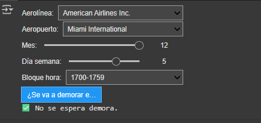

# ✈️ SMART FLIGHTS – Predicción de Demoras en Vuelos

Este proyecto de Ciencia de Datos tiene como objetivo construir un modelo predictivo capaz de **anticipar demoras en vuelos comerciales en Estados Unidos**, utilizando datos históricos del año 2019.  
Además, se complementa con un análisis no supervisado para identificar **tipologías de aeropuertos** según sus condiciones operativas y climáticas.

---

## 📌 Contenidos del Proyecto

- Análisis exploratorio de datos (EDA)
- Limpieza y transformación de variables
- Modelado con algoritmos de clasificación supervisada
- Evaluación y comparación de métricas (Accuracy, Precision, Recall, F1-Score, ROC AUC)
- Análisis no supervisado (K-Means) para segmentación de aeropuertos
- Visualizaciones ejecutivas e insights clave
- Recomendación del modelo más efectivo

---

## 📂 Archivos del Repositorio

- `SMART_FLIGHTS_II_Alonso_Castillo.ipynb`: notebook final con todo el desarrollo del análisis
- `SMART_FLIGHTS.pdf`: presentación ejecutiva del proyecto en formato PDF

📎 **Acceso al dataset completo (CSV)**  
Debido al límite de tamaño de GitHub, el archivo `vuelos_2019.csv` se encuentra alojado en Google Drive:  
🔗 [Descargar CSV desde Google Drive](https://drive.google.com/file/d/1h1d5C24Pb_fsC0bNtqDy9TMK2W4xdokY/view?usp=drive_link)

📎 **Acceso al modelo entrenado (`modelo_knn_pipeline.pkl`)**  
🔗 [Descargar modelo KNN serializado desde Drive](https://drive.google.com/file/d/1DKpBABC5tTJNzIQYaRMbHUJUfgmiBgXd/view?usp=drive_link)

## 🎛️ Panel Interactivo con Widgets (opcional)

Durante el desarrollo se utilizó una interfaz interactiva construida con `ipywidgets`, que permitía seleccionar:

- Aerolínea ✈️
- Aeropuerto de salida 🛫
- Mes del año 📅
- Día de la semana 📆
- Franja horaria de despegue ⏰

Este panel desplegable permitía ejecutar el modelo KNN y predecir si un vuelo se iba a demorar o no, en base a los parámetros elegidos por el usuario.

⚠️ **Nota**: GitHub no soporta widgets interactivos, por lo que este componente fue **comentado** en la versión subida.  
Si deseás probar la funcionalidad completa, descargá el notebook original (🔗 https://colab.research.google.com/drive/1cRa_0ar98U_HRGRUB2BoIuiMMqEmp7rA?usp=drive_link) y ejecutalo en Google Colab o Jupyter.

### 🖼️ Ejemplo del panel desplegable:

---

## 🧠 Modelo Recomendado

Tras evaluar múltiples algoritmos (Regresión Logística, Árbol de Decisión, XGBoost, KNN), el modelo **K-Nearest Neighbors (k=5)** fue el más efectivo para detectar vuelos demorados, priorizando la métrica **Recall**, que mide la capacidad del modelo para **identificar casos positivos reales**.

Este enfoque resulta útil en contextos donde es **preferible emitir una alerta preventiva** ante una posible demora, aunque implique algunas falsas alarmas.

---

## 📊 Fuente de Datos

Los datos fueron obtenidos desde Kaggle:  
[📎 2019 Airline Delays and Cancellations – Kaggle](https://www.kaggle.com/datasets/threnjen/2019-airline-delays-and-cancellations)

---

## 👩‍💻 Autoría

**Patricia Alonso Castillo**  
Comisión 61750 – Curso de Ciencia de Datos (2025)  
Proyecto Final – CODERHOUSE

